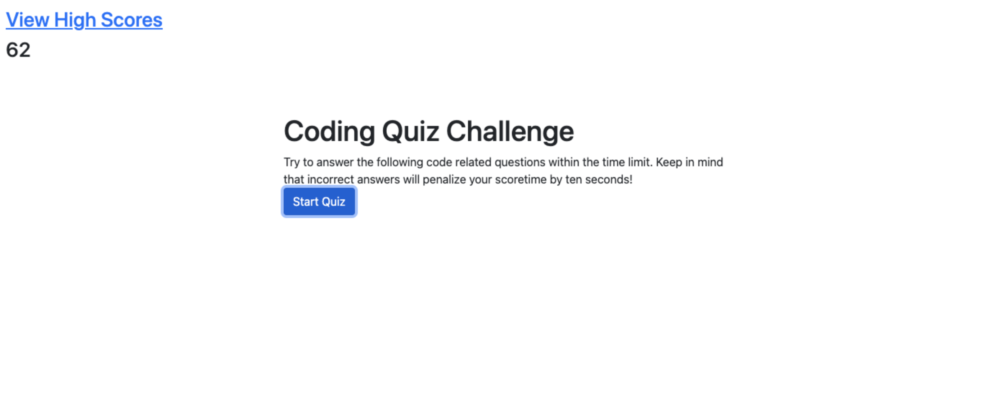

# c4-mc-quiz
# <CODING BOOTCAMP: CHALLENGE #2>

## Description

The intention of this web development project is to make an application that holds an interactive and dynamic multiple choice quiz on coding knowledge. 

My project was deployed to the following website: https://pvlln.github.io/PabloVillalon-c4-mc-quiz/

Here you will find my finished project. 

## Installation

To get my project running, you simply need to access the deployed website. The user then must answer a series of questions when prompted. This website works best using Chromium-Based browsers. 

## Usage

To use this site, you only need to answer the questions as prompted

## Credits

Credit to myself, 2023.

## License

This website is covered under the MIT copyright license. For more information, google it. 

## Badges

Nope, no badges. 

## Features

My project uses javascript functions and the local storage. You may see them in action in the developer console. 

## How to Contribute

I am not accepting contributions to this site. 

## Tests

In order to test the functionality of the site, you may take the quiz several times and see how the functions work!. 
